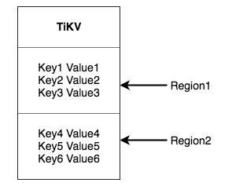
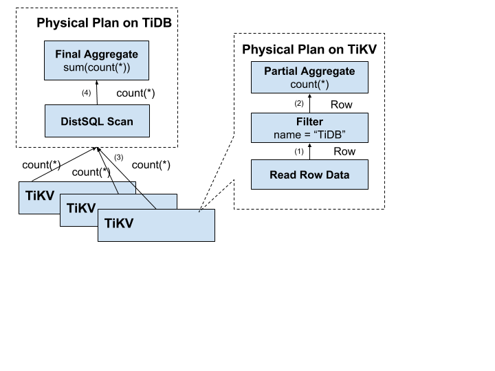

# 一.存储

1.tikv的存储模型是key-value模型。可以看做一个巨大的map(k,v都是byte数组，k二进制顺序有序），可以seek(可参考c里面的seek函数)到某一个key的位置，然后不断的调用next放一递增的顺序获取比这个key大的key-value.

2.RocksDB （存储引擎）是一个单机的 Key-Value Map.

3.raft还是比较了解的这里就不写了。tikv里面Raft的利用大概是这样一个过程。
data->raft log(数据变成raft log，然后复制)->rocksdb->disk。（总结一下就是利用raft的日志复制来做数据复制。）

4.数据分散到多台机器上有两种典型的方案：

    1.一种是按照 Key 做 Hash，根据 Hash 值选择对应的存储节点（感觉和一致性hash差不多）
    
    2.另一种是分 Range，某一段连续的 Key 都保存在一个存储节点上（hbase啦，row key保存为byte数组，数据按照row key的字典序排序存储）
    
5.Region(看到region就会想到hbase。region是分布式存储的最小单元)。将k-v空间分成多段，每一段是一系列连续的key,每一段就是一个region。每一个 Region 都可以StartKey 到 EndKey 这样一个左闭右开区间来描述。

（偷来的图  !(-.-)  )
     
     1.以region为单位，将数据分散在集群中所有的节点上，并且保证每个节点上服务的region数量差不多
     
     2.以region为单位做raft的复制和成员管理
     
     3.一个region会有多个副本，每一个副本叫做一个replica，replica之间通过raft来保持一致，一个region的多个replica会保存在不同节点上，构成一个raft group。其中一个replica会作为这个group的leader，其他的则是follower。读写通过leader进行，再由leader复制给follower。
     

5.mvcc多版本并发控制

     1.tikv是是通过在key后面添加version来实现的.(没加前k->v,加之后k-v(version)->v)。
     
     2.对于一个key的多个版本，把版号大的放前面，版号小的放后面。利用seek(key-version)定位到第一个大于等于这个key-version的位置。

# 二.计算

1.tidb对每一个表分配一个TableID,每一个索引都会分配一个indexID，每一行分配一个RowID（如果表有整数型的 Primary Key，那么会用 Primary Key 的值当做 RowID）。其中TableID在整个集群中唯一，indexID/RowID在表内唯一，这些ID都是int64类型。

2.数据按照规则编码成k-v。(key:Key: tablePrefix{tableID}_recordPrefixSep{rowID},Value: [col1, col2, col3, col4])

3.索引编码：key:tableID+indexID+columnsvalue,value:rowID(简写)

4.唯一索引编码：key;tableID+indexID+columnsvalue+row,value:null

5.保证编码前和编码后的比较关系不变（mencomparable）

6.元信息的管理：利用database/table的唯一ID再加上前缀m_编码出唯一的key,value存储元信息。此外还有一个后台线程不断检查schema版本是否发生变化，并保证在一定时间内一定能够获取版本变化。

偷图(～.～)

7.分布式sql的计算。早点看到这部分内容就好了，这部分和talent-plan的week3,week4感觉还是很贴近的。起码group by下推还是想对了，其次下面这图的流程和week4很贴近。

偷图(～.～)

8.sql层架构

偷图(～.～)

     

     

