# 一.环境搭建
    
     要读一个开源项目我们至少要把它集成到编辑器里面。
     
    1.在本地构建tidb的方法 https://github.com/pingcap/tidb/blob/master/CONTRIBUTING.md
    
    2.如果make失败（不能FQ），可使用这个代理  https://goproxy.io/zh/
    
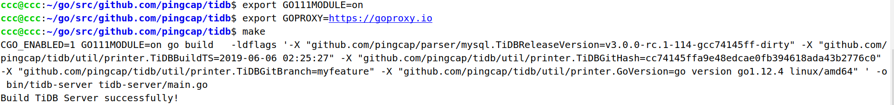

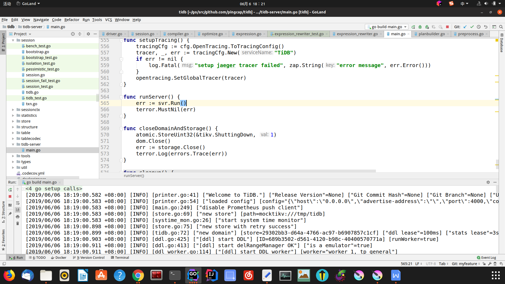

# 二.一条sql的前世今生

    1.从宏观来讲tidb的整个流程就是mysql-cli发送请求到tidb-server调用distsql-Api去tikv操作数据（拿，存等等）
    
    或去pd拿时间，tso,region信息等。
          

    2.SQL层架构
    
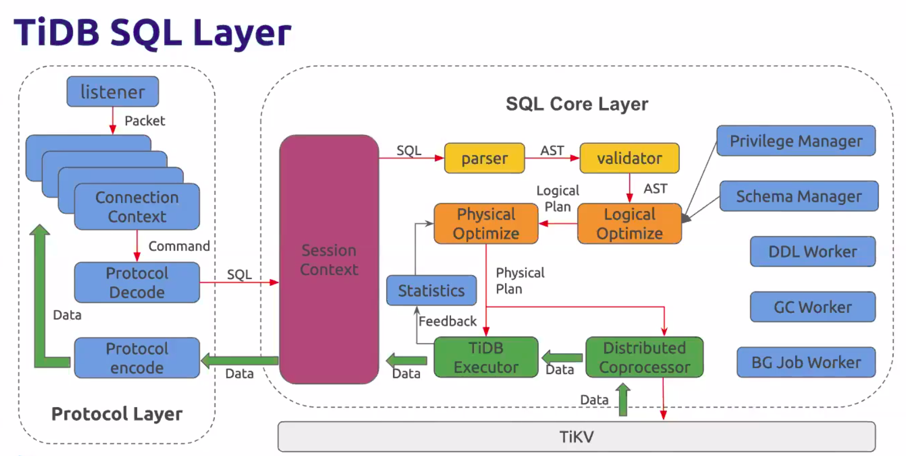

    任何程序都会有一个开头就是main，那么tidb的main函数在哪呢？
    
    答案：在tidb-server里。
    

    
    main函数的内容都有那些呢？
    
    答案：这里面注册了stores,监控，全局变量，加载配置等开发程序时共通的一些东西。
    

    当服务启动之后主要的逻辑就转到了server这个package下
    
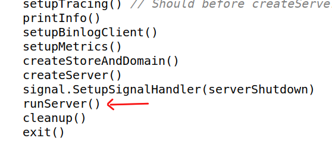   

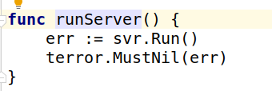   

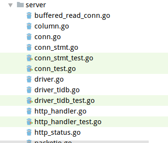

    server中最重要的就是server.Run(),当服务监听到一个套接字后就会一直监听在这个端口上面来一个链接就会new一个connection来处理它。
    

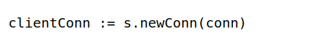   

    所以处理一个链接的本质就是处理一个sql请求。
    
   

    而connection流程就是read一个packet，dispatch一个packet
    

   

    这个过程中我们会根据mysql codicode协议判断接收到的cmd是一个sql还是其他，如果是sql,则根据不同的cmd，
    dispatch到不同的函数去处理。假设cmd是一个query
    
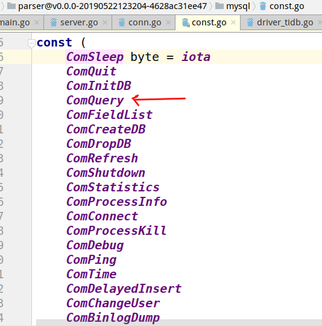   

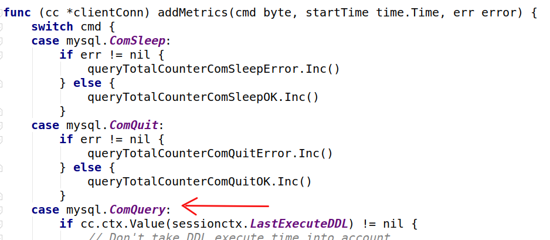   

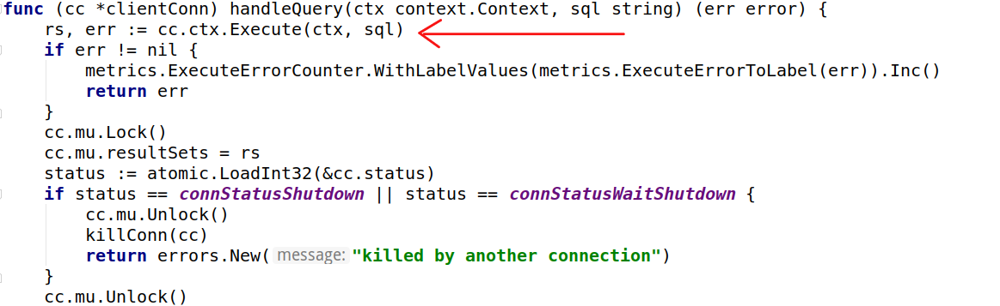   

    补充：初始化一个connection做了那些事情呢？
    
    答案：首先main函数里会注册一个driver，driver会初始化一个querycontext接口，它的具体实现是tidbcontext，
    tidbcontext没有复杂的逻辑，实际上只是对session的代理，后续的实际执行由session实现。每一个链接对应一个
    session对象
    
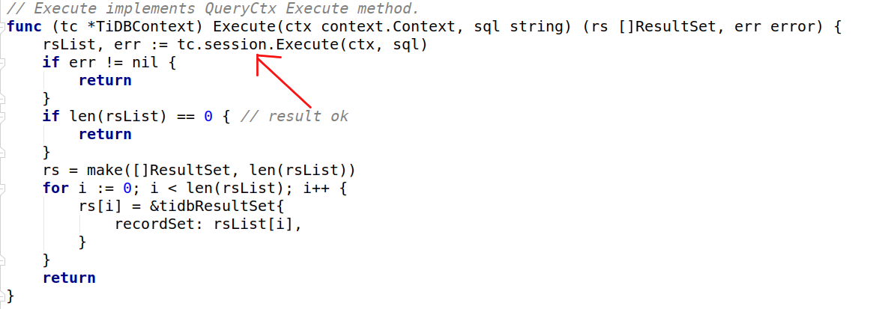   

    所以到目前为止以上内容可总结为：
    
 

    且session是一个核心数据结构
   
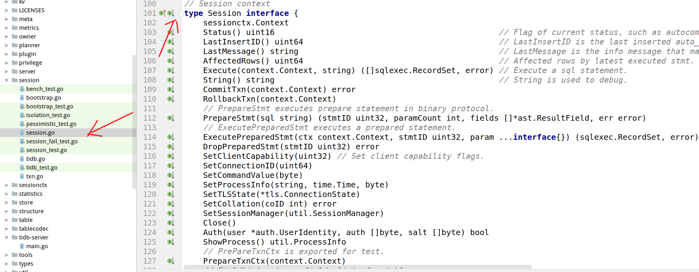 
 
    假设现在有一条sql:select  hellow。parser是如何将它转换成tidb可执行的东西的呢？首先进行词法分析，它会一个字母一个字母的去读，
    直到获取到一个完整的字符串，一看哎，这是个关键字那么就根据parser.y里的分支一直走下去得到一个ast语法树。由于parser的代码我
    还没有下载这部分就不贴图了。相应的流程图，可以去ppt。
    
    接下来我们会compile这个ast
    
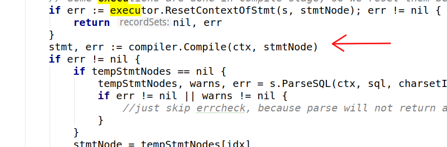 

    compile做的第一件事就是检验ast的正确性，我们会定义一个visitor去遍历整个ast树去判断它的合法性，这个的实现在
    planner包->core->preprocess里。
    
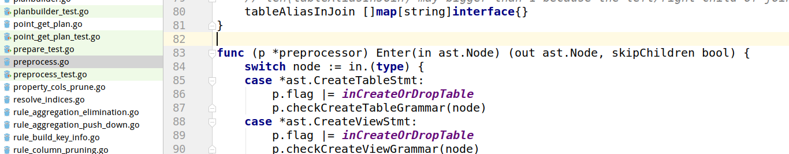 
    
    当这部分执行完毕，我们就会拿到一个tidb可处理的ast.下一步就是把它编译成一个逻辑计划
    
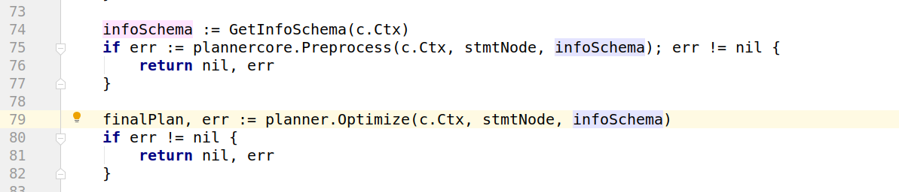 

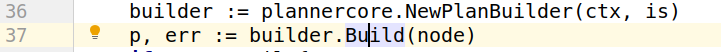

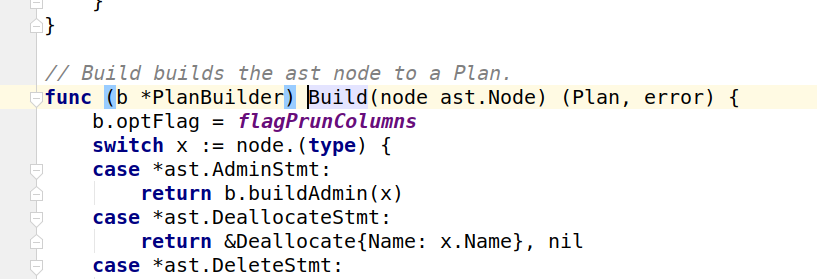 

    假设ast有一个exprnode节点，作为一个节点它是无法直接执行的所以我们要把它转成一个expression，expression是一个接口
    它有四种实现。虽然parser里面有很多节点但我们最终都要编译成这四种。（代码在planner包->core->expression_rewrite里）
                               |constant(常量)                     eg:select "hellow"
                               |scalarFunction(方法)         eg:select  cast  (1,2,3)
    expression->|
                               |column(列)                             eg:select a
                               |corralatcolumn(相关列)    eg:select  a  from  t1 left outer join t2 on t1.a = t2.a 
                               

    
    
    

