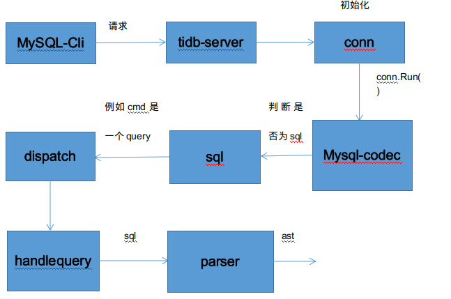
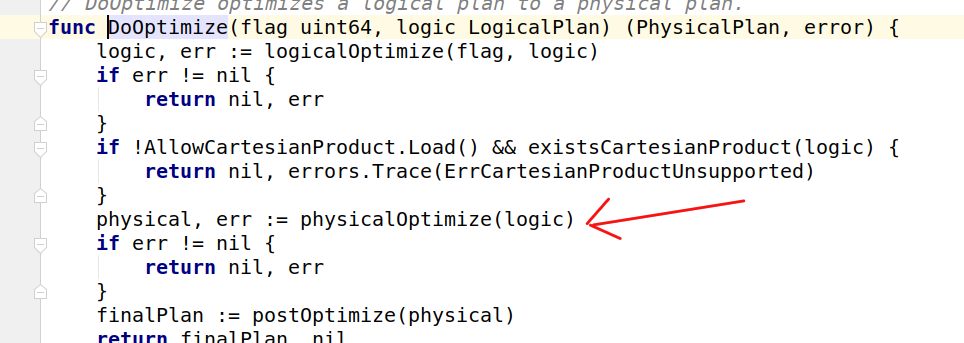
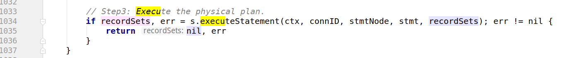
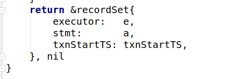
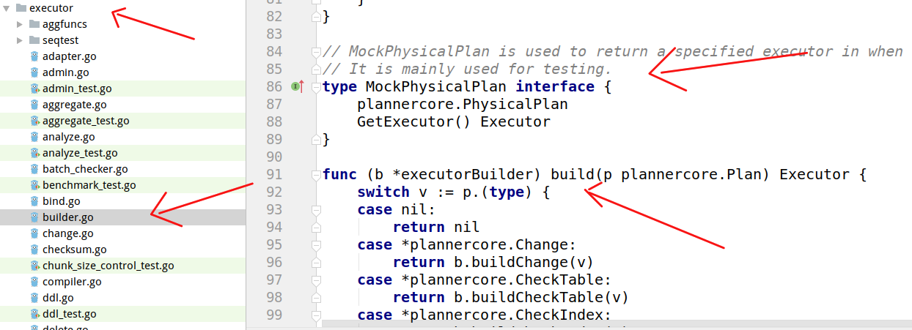
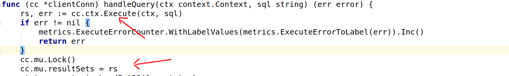
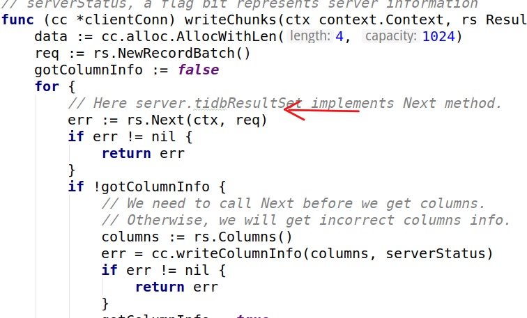

# 一.环境搭建 :sleeping:
    
## :pencil2: 要读一个开源项目我们至少要把它集成到编辑器里面。
     
**1.[在本地构建tidb的方法 ](https://github.com/pingcap/tidb/blob/master/CONTRIBUTING.md)**
    
**2.如果make失败（不能FQ），可使用这个代理  https://goproxy.io/zh/**
    


# 二.一条sql的前世今生  :yum:

## :pencil2: 1.从宏观来讲tidb的整个流程就是 mysql-cli 发送请求到 tidb-server 调用 distsql-Api 去 tikv 操作数据（拿，存等等）或去 pd 拿时间，tso , region 信息等。
          


## :pencil2: 2. SQL 层架构
    


**:pencil2:任何程序都会有一个开头就是 main ，那么 tidb 的 main 函数在哪呢?**
    
**答案：在 tidb-server 里。**
    

    
**:pencil2: main 函数的内容都有那些呢？**
    
**答案：这里面注册了 stores ,监控，全局变量，加载配置等开发程序时共通的一些东西。**
    


**:pencil2:当服务启动之后主要的逻辑就转到了 server 这个 package 下**
    
   

   


**:pencil2: server 中最重要的就是 server.Run() ,当服务监听到一个套接字后就会一直监听在这个端口上面来一个链接就会 new 一个 connection 来处理它。**
    


   

**:pencil2:所以处理一个链接的本质就是处理一个 sql 请求。**
    
   

**而 connection 流程就是 read 一个 packet ，dispatch 一个 packet **
    


   

**:pencil2:这个过程中我们会根据 mysql codec 协议判断接收到的 cmd 是一个 sql 还是其他，如果是 sql ,则根据不同的 cmd ，
 dispatch 到不同的函数去处理。假设 cmd 是一个 query **
    
   

   

   

**:pencil2:补充：初始化一个 connection 做了那些事情呢？**
    
**答案：首先 main 函数里会注册一个 driver ，driver 会初始化一个 querycontext 接口，它的具体实现是 tidbcontext ，
 tidbcontext 没有复杂的逻辑，实际上只是对 session 的代理，后续的实际执行由 session 实现。每一个链接对应一个
 session 对象**
    
   

**:pencil2:所以到目前为止以上内容可总结为：**
    
 

**:pencil2:且 session 是一个核心数据结构**
   
 
 
**:pencil2:假设现在有一条 sql : select  hellow 。parser 是如何将它转换成tidb可执行的东西的呢？首先进行词法分析，它会一个字母一个字母的去读，
直到获取到一个完整的字符串，一看哎，这是个关键字那么就根据 parser.y 里的分支一直走下去得到一个 ast 语法树。由于 parser 的代码我
还没有下载这部分就不贴图了。相应的流程图，可以去 ppt 。**
    
**:pencil2:接下来我们会 compile 这个 ast **
    
 

**:pencil2: compile 做的第一件事就是检验 ast 的正确性，我们会定义一个 visitor 去遍历整个 ast 树去判断它的合法性，这个的实现在
 planner 包-> core -> preprocess 里。**
    
 
    
**:pencil2:当这部分执行完毕，我们就会拿到一个 tidb 可处理的 ast.下一步就是把它编译成一个逻辑计划(compile->Build)**
    
 


 

**:pencil2:假设 ast 有一个 exprnode 节点，作为一个节点它是无法直接执行的所以我们要把它转成一个 expression ，expression 是一个接口
它有四种实现。虽然 parser 里面有很多节点但我们最终都要编译成这四种。（代码在 planner 包-> core -> expression_rewrite 里）**

```

                           |constant(常量)                     eg:select "hellow"
                           |scalarFunction(方法)         eg:select  cast  (1,2,3)
expression->|
                           |column(列)                             eg:select a
                           |correlatcolumn(相关列)    eg:select  a  from  t1 left outer join t2 on t1.a = t2.a 
                           
```

**:pencil2: expression_rewrite 也是一个 visitor ，它自己维护了一个 stack ，它会把字段和参数压栈，类似传统的通过运算符进栈出栈形成表达式。
总结就是如上面几个图所示 Build 的时候 expression_rewrite 会重写 ast 变成一个可执行的 logicalplan .**
    
**:pencil2:接下来就是 logical  optimize ，举个例子  select a from t1 group by 。由于只需要 a ,所以优化器就会执行列裁剪  column pruning（这部分代码都在
代码在 planner 包-> core 中）**
    
**:pencil2:然后就是进行物理优化，然后回到 compile 处，返回一个 Execstmt 。此时我们还没有拿到任何数据。我们执行 executeStatment 得到一个
 recordset 的数据集，它里面并没有真正的数据，但是有一个 Executor 。**
 
**:pencil2:physical optimize**
 

**:pencil2:recordset**
 

**:pencil2:Executor**

 
   
**:pencil2:然后根据物理计划 Build 一个 Executor 。过程和上面 Build 逻辑计划差不多，是很模板化的东西。**
     
 
    
**:pencil2:最后返回 connection 处在这里我们拿到结果集，并执行 Executor （循环调用 Next（）直到为 nil ，然后将结果返给 mysql-cli ）。
到此为止一个完整的过程结束**
    
 

 

**:pencil2:补：Executor 是一个树形结构，一般最外层的叶子节点是一个扫表或者扫索引。**

**:pencil2:ps：白色背景截图真的不好看。**


    
                               


    
    
    

