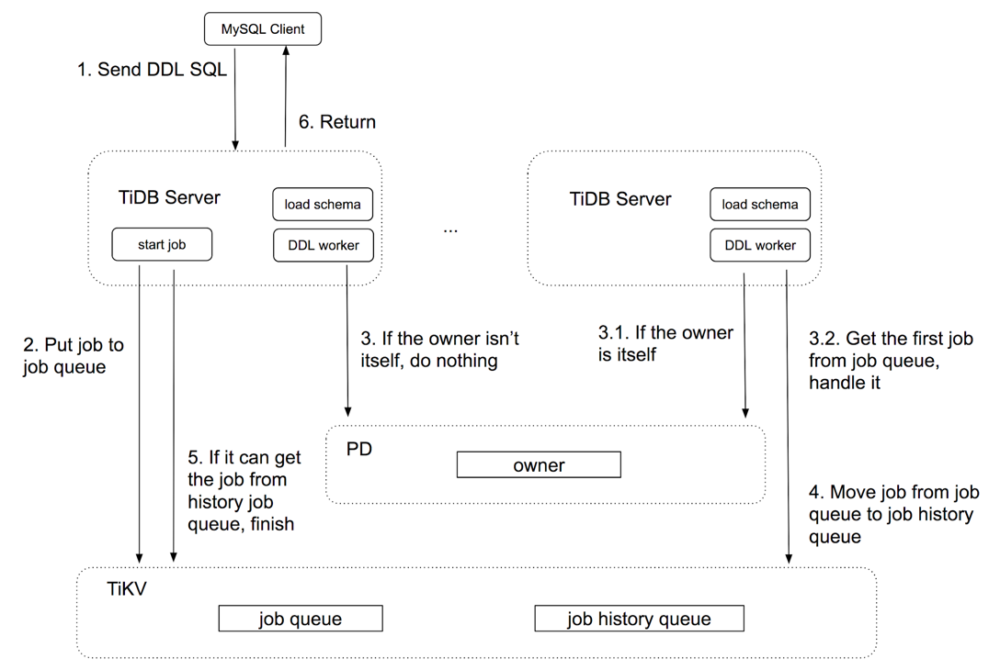

# 一.知识补充

## 1.什么是DDL?

数据库模式定义语言 DDL(Data Definition Language) ，是用于描述数据库中要存储的现实世界实体的语言。比如说：CREATE、ALTER、DROP等。DDL 主要是用在定义或改变表的结构，数据类型，表之间的链接和约束等初始化工作上.

## 2.什么是 etcd ?

etcd 是一个高可用强一致性的键值存储仓库，一般用于配置共享和服务发现。而且 etcd 也是基于 raft 的，所以 owner 的选举过程也是很好理解的。

# 二.DDL in Tidb

## 1.tidb 中的简单处理流程

1. mysql-cli 向 tidb-server 发送 ddl 请求

2.tidb-server 将 dd l请求保存到 job queue 或 job history queue 里（这两队列在tikv里）

3.判断本节点是不是 owner ，如果是就去 job queue  里获取 ddl 请求，并在本节点上 worker 执行 ddl ,执行完毕后将 job 从 DDL job 队列中移除，然后加入 history ddl job 队列中去，然后将结果返回 MySQL-cli 。如果不是就什么也不做。

## 中间举例的那几个 DDL 已经具体到函数了这里就不在叙述了。

## 2.New Parallel DDL

这里没什么很大变动，无非就是并行执行DDL，需要注意的就是新添加的 add index job queue ，以及执行它的add index worker。还有就是job依赖，例如add column a,
add index on column a就会有依赖关系，需要先执行前一句。此处通过job id大小判断，小的先执行，add column a(job 1),add index on column a(job 2)

